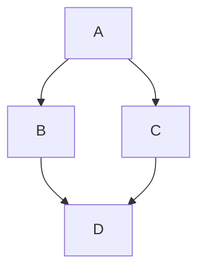

# UDIV Protokolu - Detayli Faz Rehberi

## Genel Bakis

UDIV (Anla-Tasarla-Uygula-Dogrula) dongusu, her gorevi dort fazda cozer. Bu belge her fazin detayli protokolunu, karar agaclarini ve basarisizlik senaryolarini tanimlar.

---

## Faz 1: ANLA - Detayli Protokol

### Prompt Enrichment Pipeline (Her UDIV'de Otomatik)

Faz 1 baslarken **once** asagidaki uc katmanli pipeline calisir:

**Katman 1: Default Suffix**
- Tum agent/system prompt'lara otomatik eklenir: "Think step by step and challenge your own assumptions."
- Tekrari onle: Kullanici prompt'u zaten "step by step"/"challenge" iceriyorsa eklenmez.

**Katman 2: Skill Discovery**
- Session'daki available-skills listesi okunur
- Anahtar kavramlar ile eslestirme yapilir
- BASIT skill otomatik dahil; KARMASIK skill kullaniciya sorulur
- Detay: [skill-kesif-tablosu.md](./skill-kesif-tablosu.md)

**Katman 3: Web Enrichment**
- Anahtar kavramlar icin web araması (max 1-3 arama)
- Trust scoring (0-100) ile filtrasyon
- >=90 otomatik, 70-89 onay, <70 disla
- Detay: [kaynak-guven-skorlama.md](./kaynak-guven-skorlama.md)
- Detay: [prompt-enrichment.md](./prompt-enrichment.md)

**Ariz ve Fallback**:
- Web search basarisizsa WebSearch fallback, sonra atla + bildir
- Skill tarama basarisizsa uyari ver, normal UDIV devam

### Baglam Yukleme Sirasi (Enrichment Sonrasi)

1. **Memory Graph Kontrolu**
   - `mcp__memory__search_nodes` ile gorevle ilgili anahtar kelimeleri ara
   - Bulunan entity'lerin observation'larini oku
   - Onceki oturumlardaki kararlar, tercihler ve kaliplari not et

2. **Proje Baglami**
   - CLAUDE.md → aktif teknolojiler, proje yapisi, komutlar
   - constitution.md → prensipler (varsa)
   - Son git log → yakin zamandaki degisiklikler

3. **Kod Kesfetme Stratejisi**
   - Bilinen dosya/fonksiyon → dogrudan Read/Grep
   - Belirsiz kapsam → Explore agent (quick/medium/very thorough)
   - Birden fazla alan → paralel Explore agent'lar (max 3)

### "Yeterli Anlama" Kriterleri

**Kesfetme Limiti**: Maksimum **7 arac cagrisi** (enrichment pipeline + Explore agent, Grep, Glob dahil). Bu limite ulasinca asagidaki kontrol listesini degerlendir.

Asagidakilerin en az **4/5'ini** cevaplayabilmelisin (hepsini karsilamaya calisarak donguye girme):
- [ ] Kullanicinin asil amaci ne? (soyledigi vs gercekte istedigi)
- [ ] Hangi dosyalar/moduller etkilenecek?
- [ ] Mevcut kodda bu islevi yapan veya benzer bir sey var mi?
- [ ] Degisikligin yan etkileri ne olabilir?
- [ ] Constitution prensiplerinden hangisi ilgili?

**Karar Agaci:**
- 5 arac cagrisi kullanildi VE 4/5 kriter karsilandi → Anlama ozeti sun
- 5 arac cagrisi kullanildi AMA < 4 kriter karsilandi → Cevaplanamayan kriterleri kullaniciya sor (daha fazla kesfetme yapma)
- < 5 arac cagrisi VE 5/5 kriter karsilandi → Erken bitir, anlama ozeti sun

### Soru Sorma Karar Agaci

```
Belirsizlik var mi?
├── Hayir → Anlama ozeti sun
└── Evet → Kesfetme limiti doldu mu?
    ├── Evet → Belirsizligi kullaniciya sor (kesfetmeye DEVAM ETME)
    └── Hayir → Belirsizlik tipi?
        ├── Teknik (hangi yaklasim?) → Kesfetmeye devam et (limit dahilinde)
        ├── Niyet (ne istiyor?) → Kullaniciya sor
        ├── Kapsam (ne kadar?) → Kullaniciya sor
        └── Oncelik (hangisi once?) → Kullaniciya sor
```

### Anlama Ozeti Formati

```
## Anlama Ozeti

**Gorev**: [kullanicinin istedigi, kendi kelimelerimle]
**Etki Alani**: [etkilenecek dosyalar ve moduller listesi]
**Mevcut Durum**: [ilgili kodun su anki hali]
**Bagimliliklar**: [bu degisikligin bagimli oldugu diger parcalar]
**Riskler**: [dikkat edilmesi gereken noktalar]
**On Yaklasim**: [ilk yaklasim fikri, detay Faz 2'de]

### Enrichment Raporu (yeni)
**Eslesen Skill'ler**:
- [Skill adi] (BASIT/KARMASIK) — [otomatik dahil / onay bekliyor / red]

**Web Enrichment Kaynaklari** (trust score >=90):
- [Kaynak 1] (95) — [URL]
- [Kaynak 2] (92) — [URL]

**Orta-Skor Kaynaklar** (70-89, onay gerekli):
- [Kaynak X] (82) — dahil edilsin mi?

Bu anlamayi onayliyor musun, yoksa duzeltme/ekleme var mi?
```

---

## Faz 2: TASARLA - Detayli Protokol

### Yaklasim Uretme Kurallari

- **Minimum 2 yaklasim**: Basit/hizli vs kapsamli/saglam
- **Maximum 3 yaklasim**: Fazlasi karar yorgunlugu yaratir
- Her yaklasim icin:
  - Degistirilecek dosyalar ve tahmini satir sayisi
  - Yeni olusturulacak dosyalar
  - Silinecek/kaldirilacak kod
  - Karmasiklik seviyesi (dusuk/orta/yuksek)

### Degerlendirme Matrisi

Her yaklasimi su boyutlarda puanla (1-5):

| Boyut | Aciklama |
|-------|----------|
| Basitlik | Daha az kod, daha az dosya degisikligi |
| Saglamlik | Hata dayanikliligi, edge case kapsamasi |
| Genisletilebilirlik | Gelecek ihtiyaclara uyum |
| Mevcut Kaliplar | Projenin mevcut mimarisine uyum |
| Constitution Uyumu | Prensiplerle uyumluluk |

### Oneri Sunma Formati

```
## Tasarim Onerileri

### Yaklasim A: [isim] ⭐ Onerilen
[Kisa aciklama]
- Dosyalar: [liste]
- Artilari: [...]
- Eksileri: [...]
- Karmasiklik: [dusuk/orta/yuksek]

#### Görsel Mimari (Yaklasim A)


### Yaklasim B: [isim]
[Kisa aciklama]
- Dosyalar: [liste]
- Artilari: [...]
- Eksileri: [...]
- Karmasiklik: [dusuk/orta/yuksek]

**Onerim**: Yaklasim A, cunku [neden].
Hangi yaklasimi tercih ediyorsun?
```

---

## Faz 3: UYGULA - Detayli Protokol

### Self-Healing & Context Pruning

- **Auto-Rollback Hazırlığı**: Kritik dosyalar veya 3'ten fazla dosya değişecekse terminal komutuyla `git stash save "LogosFortuna-UDIV-Backup"` veya `git checkout -b logos-fortuna-temp` yap.
- **Akilli Baglam Budama**: Kullanıcı tasarımı onayladıktan sonra önceki fazların analiz detaylarını bir cümlelik "Kararlar" listesine indir ve hafızadan drop ederek (veya unutarak) token tasarrufu sağla. Sadece çalışılacak dosyaların aktif içeriğine odaklan.

### Artim Buyuklugu Kurallari

- **Ideal artim**: 1 dosya, 10-50 satir degisiklik
- **Maksimum artim**: 3 dosya, 100 satir degisiklik
- **Asla**: 5+ dosyayi ayni anda degistirme

### Artim Dogrulama Kontrol Listesi

Her artimdan sonra:
1. **Syntax**: Dosya tipi kontrol (py_compile, tsc --noEmit)
2. **Import**: Yeni import'lar dogru mu?
3. **Test**: Ilgili testler geciyor mu? (`pytest dosya.py`, `npm test`)
4. **Lint**: Stil kurallari saglaniyor mu? (`ruff check`, `eslint`)

### Geri Alma Protokolu (Max 3 Deneme/Artim)

Her artim icin deneme_sayaci = 0 olarak basla. Eger 3 deneme basarisiz olursa, Faz basladiginda alinan snapshot'a (`git checkout logos-fortuna-temp` veya `git stash pop`) geri donerek sistemi kirik durumda birakma.

```
Artim basarisiz oldu → deneme_sayaci += 1
├── deneme_sayaci > 3 → DURDUR -> GIT ROLLBACK TETIKLE
│   └── Kullaniciya raporla: "Artim [X] 3 denemede basarilamadi. Sistem rollback edildi. Yaklasim degisikligi gerekebilir."
│
├── Syntax hatasi → Hemen duzelt (basit typo), tekrar dene
├── Test basarisizligi → Analiz et
│   ├── Yeni testin kendisi yanlis → Testi duzelt, tekrar dene
│   ├── Mevcut test kirildi → Kodu geri al, tasarimi revize et
│   │   └── Bu durum faz geri donusu sayilir (geri_donus_sayaci[3→2] += 1)
│   └── Ilgisiz test basarisizligi → Not et, devam et
└── Lint hatasi → Hemen duzelt, tekrar dene
```

### Ilerleme Takibi

Her artim sonrasi TaskUpdate ile ilerlemeyi guncelle:
```
Artim 1/5: ✅ Model dosyasi olusturuldu (Token ROI: Orta)
Artim 2/5: ✅ Schema tanimlandi
Artim 3/5: 🔄 Service katmani yaziliyor...
Artim 4/5: ⏳ API endpoint
Artim 5/5: ⏳ Frontend entegrasyonu
```

---

## Faz 4: DOGRULA ve OGREN - Detayli Protokol

### 5 Boyutlu Dogrulama + Ek Testler

**1. Fonksiyonel Dogrulama**
- Tum testler geciyor mu?
- Manuel test senaryolari basarili mi?
- Edge case'ler ele aliniyor mu?

**2. Anayasal Dogrulama**
- constitution.md prensipleri saglanyor mu?
- Her prensip icin spesifik kontrol yap
- Ihlal varsa → KRITIK, Faz 3'e geri don (geri_donus_sayaci[4→3] kontrol et)

**3. Niyetsel Dogrulama**
- Kullanicinin Faz 1'de onayladigi niyet karsilaniyor mu?
- Ekstra veya eksik islevsellik var mi?

**4. Performans ve Maliyet Profiler (Token ROI)**
- Yazılan algoritmaların Big-O notasyonunda zaman/alan karmaşıklığı hesaplandı mı?
- LLM Token tüketimi ile yazılan özellik değeri orantılı mı?

**5. Proaktif Tehdit Avcılığı (Chaos / Mutation Testleri)**
- Sistemin ne kadar kırılgan olduğunu görmek için rastgele değerlerle (Chaos Engineering) stres testi yapılacak yerler tespit edildi mi?
- Mutasyon testleri için zayıf notasyonlar işaretlendi mi?

**6. Yapisal Dogrulama**
- Projenin mevcut mimarisine uygun mu?
- Isimlendirme kurallari takip ediliyor mu?

**7. Regresyon Dogrulama**
- Mevcut islevsellik bozuldu mu?
- Diger modullere yan etki var mi?
- Performans etkisi var mi?

### Guven Skorlama

Her boyut icin 0-100 skalasinda skor:
- **90-100**: Kesinlikle uyumlu, sorun yok
- **70-89**: Buyuk olcude uyumlu, kucuk iyilestirmeler mumkun
- **50-69**: Kismi uyum, dikkat gerektiren noktalar var
- **0-49**: Ciddi sorunlar, geri donus gerekli

Sadece guven >= 80 olan sorunlari raporla (false positive onleme).

### Ogrenme Cikartma Sablonu

```
## Oturum Ogrenimleri

### Kullanici Tercihleri
- [gozlemlenen tercih]: [baglam]

### Proje Kaliplari
- [kesfedilen kalip]: [nerede/nasil]

### Basarili Yaklasimlar
- [ne yapildi]: [neden isledi]

### Kacinilacak Yaklasimlar
- [ne denendi]: [neden islemedi]
```

---

## Dongu Koruma ve Sayaclar

### Sayac Tanimlari

Dongu basinda tum sayaclar sifirlanir:
```
geri_donus_sayaci[4→3] = 0  # Dogrulama → Uygulama geri donusleri
geri_donus_sayaci[3→2] = 0  # Uygulama → Tasarla geri donusleri
geri_donus_sayaci[2→1] = 0  # Tasarla → Anla geri donusleri
faz1_kesfetme_adimi = 0     # Faz 1'deki arac cagrisi sayisi
artim_deneme[N] = 0         # Her artim icin deneme sayisi
```

### Limitler ve Eskalasyon

| Sayac | Limit | Eskalasyon |
|-------|-------|------------|
| geri_donus_sayaci[X→Y] | **2** | "Bu faz ciftinde 2 geri donus yapildi. Yaklasim degisikligi gerekiyor." |
| faz1_kesfetme_adimi | **5** | Mevcut bilgiyle devam et veya kullaniciya sor |
| artim_deneme[N] | **3** | "Bu artim basarilamadi. Alternatif yaklasim gerekiyor." |
| dogrulama_uygulama_turu | **2** | Kalan sorunlari kullaniciya sun |

### Yakinlasma ve Iraksama Tespiti

- **Yakinlasma isareti**: Her iterasyonda sorun sayisi azaliyor → devam et
- **Iraksama isareti**: Sorun sayisi artiyorsa veya yeni sorunlar cikiyorsa → hemen dur, kullaniciya danist
- Bir duzeltme 2+ yeni sorun yaratiyorsa → bu yaklasim uygun degil, geri donus sayacini artir

---

## Ozel Durumlar

### Kucuk/Basit Gorevler (tek dosya, < 20 satir)
- Faz 1: Hafif kesfetme (max 2 arac cagrisi)
- Faz 2: **ATLA** — dogrudan uygulamaya gec
- Faz 3: Tek artim
- Faz 4: Hafif dogrulama (syntax + test yeterli)
- Dongu koruma limitleri yine gecerli

### Orta Gorevler (2-5 dosya, net kapsam)
- Faz 1: Normal kesfetme (max 5 arac cagrisi)
- Faz 2: Tek oneri yeterli (2. yaklasim opsiyonel)
- Faz 3: Normal artimsal uygulama
- Faz 4: Normal 5 boyutlu dogrulama

### Acil Duzeltmeler (bug fix)
- Faz 1: Hatanin kok nedenini bul
- Faz 2: Atla (tek yaklasim yeterli)
- Faz 3: Duzeltmeyi uygula
- Faz 4: Regresyon testi oncelikli

### Buyuk/Karmasik Ozellikler (5+ dosya, yeni modul)
- Faz 1: Kapsamli kesfet (very thorough Explore)
- Faz 2: Mutlaka 2-3 yaklasim sun
- Faz 3: Alt gorevlere bol, her biri kendi UDIV mini-dongusu
- Faz 4: Kapsamli 5 boyutlu dogrulama
- Dongu koruma limitleri her mini-dongu icin ayri uygulanir
